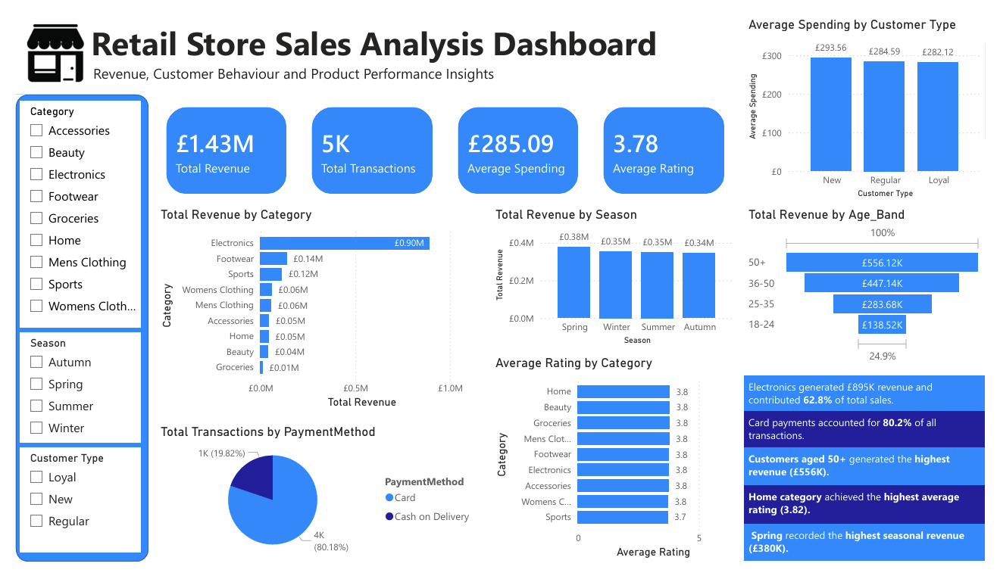

###### **Retail Store Sales Analysis Dashboard**

**Project Overview**

This project analyses retail store sales data to understand revenue performance, customer behaviour, product ratings, payment methods and seasonal trends.

**Tools Used**

- Excel: Data cleaning and preparation

- MySQL: SQL analysis

- Power BI: Dashboard creation and data visualization

**Dataset**

The dataset contains 5,000 retail transactions with customer, product, revenue, rating, discount and purchase behaviour fields.

**Dataset Source:**

Retail Store Sales Dataset (Kaggle)

https://www.kaggle.com/datasets/hassanjameelahmed/store-sales

**Business Questions Answered**

1\. Total revenue generated

2\. Revenue by category

3\. Top purchased items

4\. Customer demographics

5\. Average spending by gender

6\. Seasonal sales performance

7\. Payment method usage

8\. Discount effectiveness

9\. Customer loyalty analysis

10\. Product price variability

11\. Highest rated categories

12\. Highest rated products

13\. Average spending by age band

14\. Repeat purchase behaviour

15\. Revenue contribution percentage

**Dashboard Preview**

**Key Insights**

- Electronics generated £895K revenue and contributed 62.8% of total sales.

- Card payments accounted for 80.2% of all transactions.

- Customers aged 50+ generated the highest revenue (£556K).

- Home category achieved the highest average rating of 3.82.

- Spring recorded the highest seasonal revenue of £380K.

**Skills Demonstrated**

\- Data cleaning in Excel

\- SQL aggregation and analysis

\- CASE WHEN segmentation

\- Subqueries

\- Power BI dashboard design

\- KPI cards, slicers and business insights

